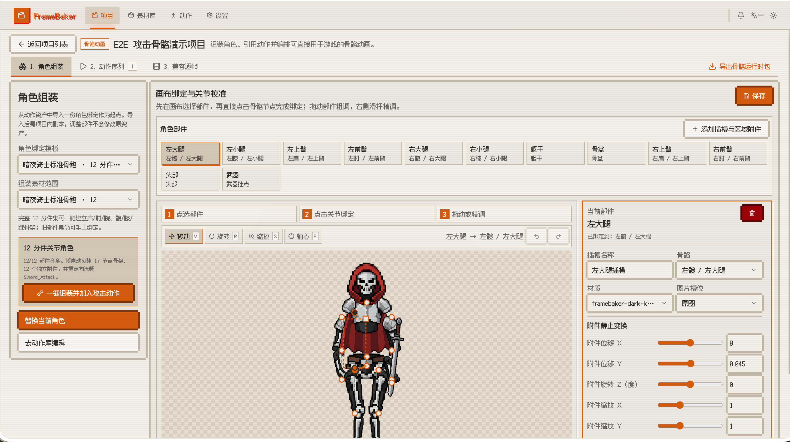
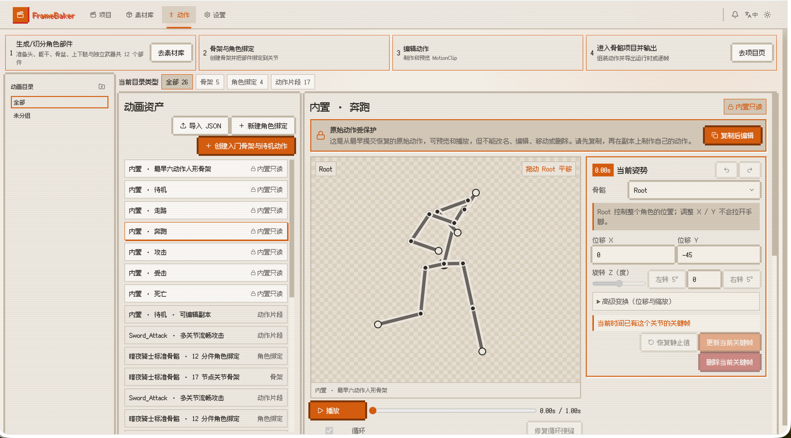

# FrameBaker

**Pixel-art frame-by-frame animation editor — a Bun full-stack app.**

Import sprites from anywhere (GIF/MP4 frame extraction, PNG upload, external CLI generation), cut out backgrounds with the built-in rembg matting engine, review results in the materials library, then edit frames on a PixiJS onion-skin canvas, arrange the timeline, preview playback, and export a spritesheet.

> 🚧 **In progress:** support for multi-axis frame animation and skeletal-animation binding is under active development.


**English** | [中文](README.zh-CN.md)


> 🚧 **In progress:** skeletal binding and skeletal-animation editing are under development.

| Character skeletal binding | Skeletal animation editor |
| --- | --- |
|  |  |

| Frame editor | Materials library |
| --- | --- |
|  |  |

| Playback preview | Dark theme (Magnetic Night) |
| --- | --- |
|  |  |

| Video material (custom pixel-style player) | Frame extract editor (VIDEO CUT LAB) |
| --- | --- |
|  |  |

## Features

- **Multi-source import** — GIF / MP4 frame extraction via ffmpeg (adjustable fps), multi-select PNG upload, external generator CLI (`FRAMEBAKER_GEN_CLI`)
- **Video materials & frame extract editor** — generated/uploaded videos get a custom pixel-style player (checkerboard backdrop, click-to-play, themed scrubber); the "VIDEO CUT LAB" editor scrubs to an exact frame and marks it, or fills a time range at a target fps, then extracts up to 64 frames as image materials in one batch (optionally matted on the way out)
- **Built-in matting** — rembg works out of the box (u2net by default, custom models supported); custom CLI template optional; before/after compare slider to review cutouts
- **Materials library** — a first-class staging area: generate or upload, matte, compare, then import into any project — single or batch
- **Frame editor** — PixiJS v8 canvas with onion skin, grid, viewport zoom, draggable offsets, scale / rotation / opacity controls, crop-and-replace, per-frame duration, and keyframes
- **Timeline & batch ops** — drag to reorder, Cmd/Ctrl+Click and Shift+Click multi-select, batch delete / duplicate / set duration
- **Humanoid motion rig** — choose a CC0 Quaternius Universal Animation Library action sampled at 8–16 frames and get immediate playback, tune motion range / arm swing / leg stride / body bounce / lean across the entire clip, then optionally fine-tune individual FK joints before pose-sheet export
- **Spritesheet export** — pure client-side canvas packing with frame transforms baked into aligned cells → `*.spritesheet.png` + `*.json`
- **Cassette Futurism themes** — dark "Magnetic Night" / light "Beige Terminal"; follows system preference until you pick one (tri-state toggle)
- **Live sync** — WebSocket broadcasts for job progress and frame/material changes
- **Adjustable layout** — drag the split dividers to resize the frame list and timeline (persisted)
- **MCP server** — built-in [Model Context Protocol](https://modelcontextprotocol.io) endpoint (`POST /mcp`, Streamable HTTP) exposing 33 tools for AI assistants (Claude Desktop, Cursor, Windsurf) to manage projects, frames, materials, generation, matting, jobs, and settings programmatically

## System Requirements

- **Windows 10/11, macOS, or Linux** — Windows has been verified on real hardware for server startup, frontend serving, APIs, SQLite storage, and ffmpeg detection
- **Bun 1.3+** — required; reopen your terminal after installation and verify that `bun --version` works
- **ffmpeg** — only required for GIF/MP4 frame extraction; PNG imports and editing do not need it
- **uv (recommended) or Python 3** — only needed for the bundled matting engine; uv can download an isolated Python without a system Python installation
- A modern browser with WebGL (PixiJS v8 canvas)

### Windows prerequisites (PowerShell)

```powershell
# 1. Install Bun (or see https://bun.sh/docs/installation)
powershell -c "irm bun.sh/install.ps1 | iex"

# 2. Install ffmpeg when GIF/MP4 extraction is needed
winget install ffmpeg

# 3. Install uv when matting is needed (or install Python from python.org and add it to PATH)
powershell -ExecutionPolicy ByPass -c "irm https://astral.sh/uv/install.ps1 | iex"

# Reopen PowerShell after installation, then verify:
bun --version
ffmpeg -version
uv --version
```

> `setup_matting.ps1` prefers uv and creates an isolated Python 3.12 environment; it falls back to Python from `PATH` when uv is unavailable. The Microsoft Store `python.exe` app execution alias is not a Python installation.

## Quick Start

```bash
bun install
bun dev          # dev mode (--hot) → http://localhost:3000
# or
bun start        # production
```

- ffmpeg is required for frame extraction: `brew install ffmpeg` (macOS) / `winget install ffmpeg` (Windows)
- **Matting engine** (optional; install once per new environment):
  ```bash
  ./scripts/setup_matting.sh            # macOS / Linux (CPU, default)
  ./scripts/setup_matting.sh --gpu      # macOS / Linux (NVIDIA GPU via onnxruntime-gpu)
  # Windows (PowerShell):
  powershell -ExecutionPolicy Bypass -File scripts\setup_matting.ps1           # CPU
  powershell -ExecutionPolicy Bypass -File scripts\setup_matting.ps1 -Gpu      # GPU
  ```
  Creates `.venv-matting/` and installs `rembg[cli,cpu]` (or `rembg[cli,gpu]`); on Windows it prefers uv-managed Python 3.12. The u2net model downloads automatically to `storage/models` on first use. Skipping this leaves matting in passthrough mode (copies the original image with a warning).

  **GPU mode** requires an NVIDIA GPU and a matching CUDA Toolkit installation. `onnxruntime-gpu` version must align with your CUDA version (e.g. onnxruntime-gpu 1.16 ↔ CUDA 11.8, 1.17+ ↔ CUDA 12.x). If you get DLL load errors, verify CUDA is installed and the version matches. To switch between CPU and GPU, delete `.venv-matting/` and re-run the script with the other flag.
- Type check: `bun run typecheck`
- Unit tests: `bun run test`
- Core unit-test coverage report: `bun run test:coverage` (currently covers shared rules, frame geometry, and ZIP export)

### Windows Notes & Gotchas

The project runs on Windows but there are several platform-specific things to be aware of:

1. **`bun dev` uses `--watch`, not `--hot`** — Bun 1.3 on Windows has a bug where browser HMR reorders PixiJS 8's circular-dependency initialization, causing a blank canvas. The dev script therefore uses `--watch` (server auto-restart on file changes, but no frontend HMR). **You must manually refresh the browser** after editing frontend code. macOS/Linux keep full HMR.

2. **PixiJS is loaded from CDN, not from the npm package** — `apps/web/index.html` includes a `<script>` tag pointing to `cdn.jsdelivr.net/npm/pixi.js@8.19.0/dist/pixi.min.js`. This bypasses Bun's bundler, which mis-handles PixiJS's circular imports on Windows. The browser's first load needs internet access to `cdn.jsdelivr.net`; subsequent loads use the cache. If you need offline use, download `pixi.min.js` to `apps/web/public/` and point the `<script>` there.

3. **Server dev mode is disabled on Windows** — `apps/server/src/index.ts` sets `development: false` on `win32` to prevent Bun's HTML dev server from injecting HMR scripts that trigger the same PixiJS bug. This does not affect production (`bun start`).

4. **Run `bun install` after every fresh checkout or dependency change** — Bun's isolated workspace layout means the local `@framebaker/shared` package is only resolvable after `bun install`. Without it, Bun may load third-party packages from its global cache but fail to resolve the workspace, causing import errors.

5. **PowerShell environment variables** — Use `$env:PORT=8080; bun dev` (semicolon, not `&&`). The `&&` operator is not supported in older PowerShell versions. Bash syntax `PORT=8080 bun dev` works on macOS/Linux.

6. **PowerShell execution policy for setup scripts** — `setup_matting.ps1` requires `-ExecutionPolicy Bypass` (e.g. `powershell -ExecutionPolicy Bypass -File scripts\setup_matting.ps1`). The script is written in ASCII to be parseable by Windows PowerShell 5.1 without a UTF-8 BOM.

7. **Microsoft Store `python.exe` is not a real Python** — Windows ships an "App execution alias" called `python.exe` that opens the Microsoft Store instead of running Python. Install Python from [python.org](https://www.python.org/downloads/) (and check "Add to PATH"), or install [uv](https://docs.astral.sh/uv/) which can download an isolated Python without a system install. `setup_matting.ps1` prefers uv and only falls back to PATH Python when uv is absent.

8. **Backslash paths for Windows scripts** — Use `scripts\setup_matting.ps1`, not `scripts/setup_matting.ps1`, when running from PowerShell or cmd.

## Matting Engine Resolution

Detected on demand (see `GET /api/config`):

1. `FRAMEBAKER_MATTING_CLI` — custom command template (`{input}` `{output}`, optional `{model}`)
2. Bundled rembg in `<repo>/.venv-matting` (`bin/rembg` on POSIX, `Scripts/rembg.exe` on Windows) — installed by `scripts/setup_matting.sh` / `setup_matting.ps1` (engine = `rembg-bundled`)
3. `rembg` found in `PATH` (engine = `rembg-path`)
4. None — passthrough copy with an install hint (engine = `none`)

rembg runs as `rembg i -m <MODEL> input output`; the model defaults to `u2net` and is cached in `storage/models` (`U2NET_HOME` is injected).

## Environment Variables

| Variable | Description |
| --- | --- |
| `PORT` | Server port, default `3000` |
| `FRAMEBAKER_GEN_CLI` | Generator CLI template; placeholders `{prompt}` `{output}` `{index}` `{reference}`. Example: `FRAMEBAKER_GEN_CLI='mygen --prompt "{prompt}" --ref {reference} -o {output}' bun dev`. `{reference}` resolves to the reference image picked in the UI (a material or project frame, resolved server-side by id — picking one while the template lacks `{reference}`, or vice versa, fails fast with HTTP 400) |
| `FRAMEBAKER_MATTING_CLI` | Custom matting CLI template; placeholders `{input}` `{output}` (optional `{model}`). Takes precedence over the bundled rembg |
| `FRAMEBAKER_MATTING_MODEL` | rembg model name, default `u2net` (e.g. `birefnet-general-lite`, `isnet-general-use`) |

## Project Structure

Bun workspaces monorepo:

- `apps/server` (`@framebaker/server`) — Elysia API + in-memory job queue + bun:sqlite; also serves the frontend via Bun's HTML import
- `apps/web` (`@framebaker/web`) — React 19 + pixi.js v8 + motion + lucide-react
- `packages/shared` (`@framebaker/shared`) — types & constants shared by both ends
- `scripts/` — setup scripts (matting engine)
- `docs/` — documentation
- `storage/` — runtime data (SQLite, frames, materials, rembg models; gitignored)

## Docs

- [docs/guide.md](docs/guide.md) — user guide (settings page, provider setup, crop tool, material processing, editor)
- [docs/architecture.md](docs/architecture.md) — architecture diagram, modules, data flows, storage layout
- [docs/api.md](docs/api.md) — API reference with request/response examples, WebSocket events, MCP endpoint
- [docs/roadmap.md](docs/roadmap.md) — shipped features and planned work

## MCP (AI Assistant Integration)

FrameBaker includes a built-in MCP server that lets AI assistants control the full application via the [Model Context Protocol](https://modelcontextprotocol.io).

**Endpoint:** `POST /mcp` (Streamable HTTP, JSON-RPC 2.0, protocol version `2024-11-05`)

Start the server (`bun dev` or `bun start`), then configure your AI client:

**Claude Desktop** (macOS `~/Library/Application Support/Claude/claude_desktop_config.json`, Windows `%APPDATA%\Claude\claude_desktop_config.json`):

```json
{
  "mcpServers": {
    "framebaker": {
      "url": "http://localhost:3000/mcp"
    }
  }
}
```

**Claude Code** (CLI): `claude mcp add framebaker --transport http http://localhost:3000/mcp`

**Cursor** (`.cursor/mcp.json`): `{ "mcpServers": { "framebaker": { "url": "http://localhost:3000/mcp" } } }`

**Windsurf** (`~/.codeium/windsurf/mcp_config.json`): `{ "mcpServers": { "framebaker": { "serverUrl": "http://localhost:3000/mcp" } } }`

The server exposes **33 tools** covering projects, frames, materials, generation, matting, folders, jobs, and system config. See [docs/api.md](docs/api.md) for the full tool list and examples.

## License

[MIT](LICENSE) © 2026 taotao7

The UI font is **Fusion Pixel 12px** (`apps/web/public/fonts/`), licensed under the SIL Open Font License 1.1 — see `apps/web/public/fonts/OFL.txt`.

### Acknowledgements and third-party projects

- [Universal Animation Library](https://quaternius.com/packs/universalanimationlibrary.html) by Quaternius — CC0 1.0 Universal. FrameBaker samples, orthographically projects and retargets the Standard GLB clips `Idle_Loop`, `Walk_Loop`, `Sprint_Loop`, `Sword_Attack`, `Hit_Chest`, `Death01`, `Jump_Start`, and `Jump_Land` into its bundled 2D local-rotation presets. The jump preset combines the launch and landing clips with a compact game-style root arc. The original GLB is not bundled.
- [huchenlei/sd-webui-openpose-editor](https://github.com/huchenlei/sd-webui-openpose-editor) by Chenlei Hu — MIT License. Its pose manipulation workflow and COCO-18 conventions were evaluated during motion-workspace design. The professional editor was intentionally not embedded in the final simple workflow, and no upstream source is bundled.
- [ZhUyU1997/open-pose-editor](https://github.com/ZhUyU1997/open-pose-editor) by Yu Zhu — MIT License. Its transform-gizmo and pose-preview workflow was studied while designing the optional per-joint fine-tuning interaction; its source code is not bundled.

## Known Limitations

Job queue is in-memory (unfinished jobs are lost on restart); GIF frame delays are ignored; single-image imports are stored byte-for-byte (PNG recommended); spritesheet export does no trimming; no authentication — local use only. See the [roadmap](docs/roadmap.md) for planned improvements.
