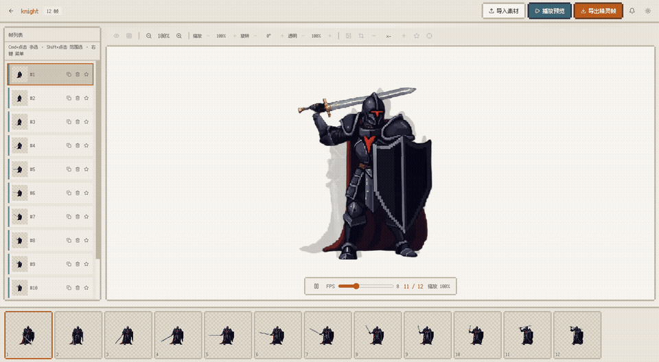
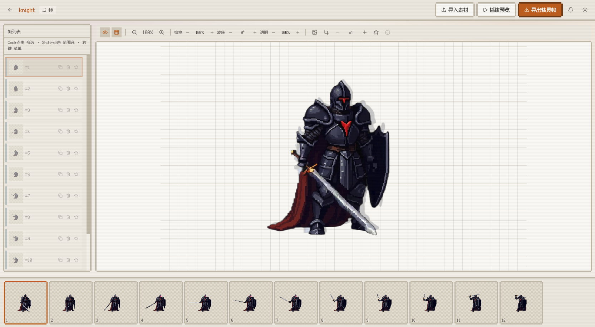
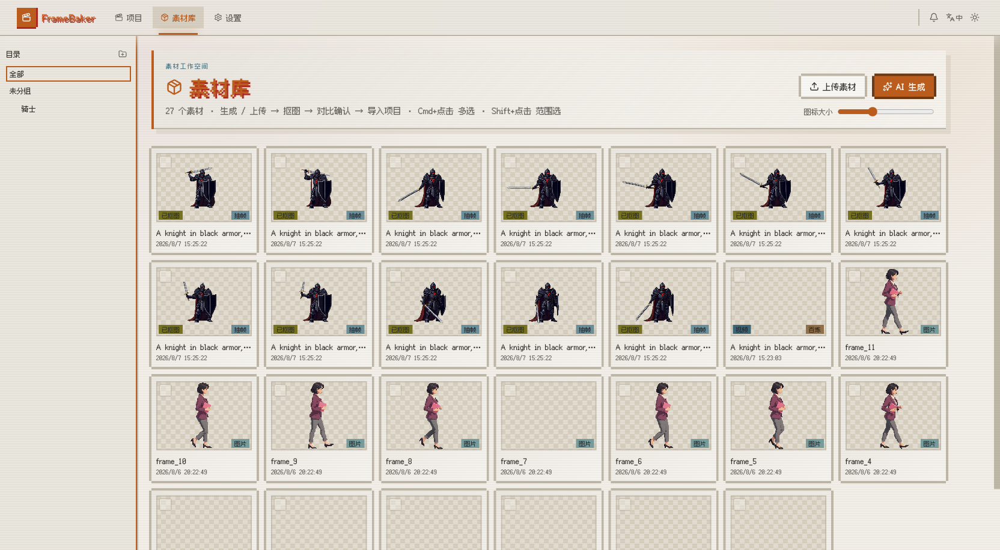
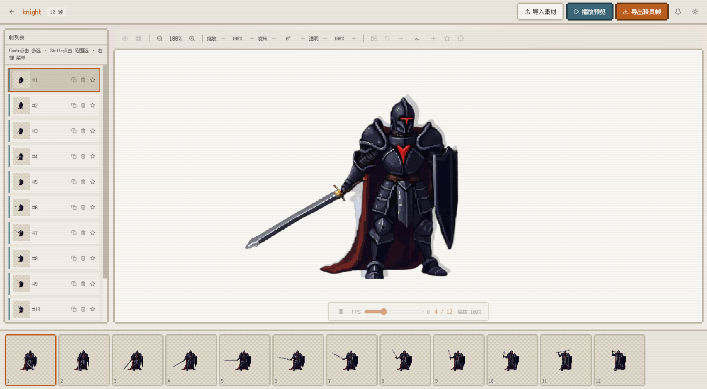
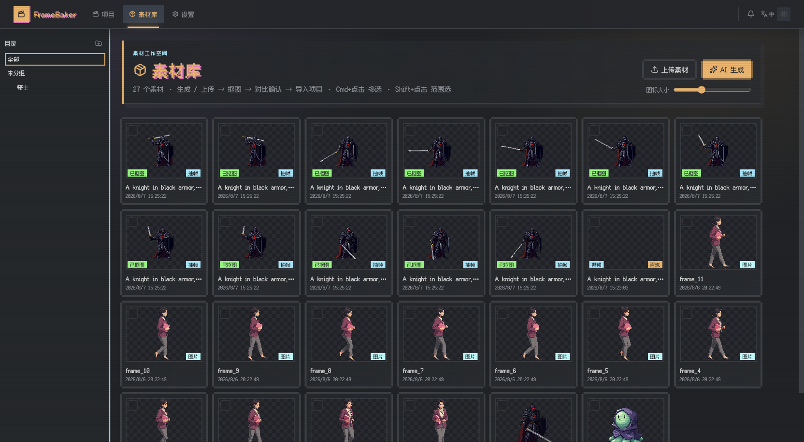
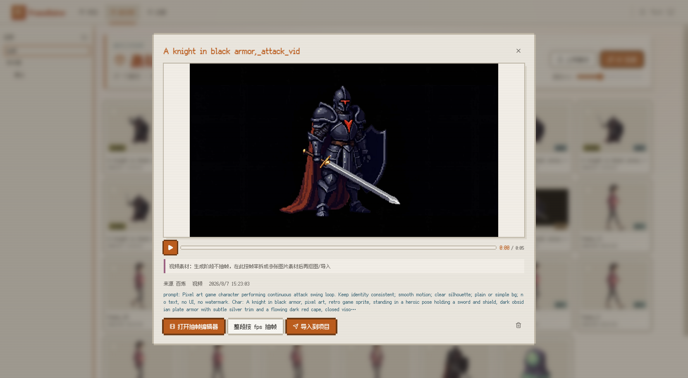
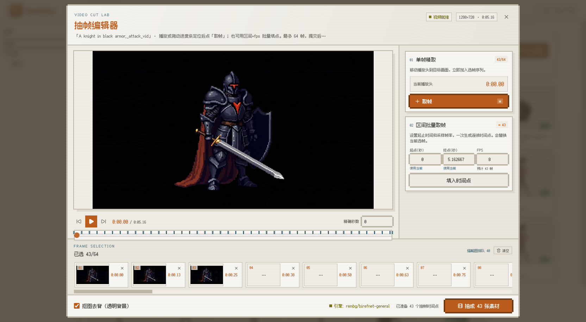

# FrameBaker

**像素风逐帧动画编辑器 —— Bun 全栈应用。**

多来源素材导入（GIF/MP4 拆帧、PNG 上传、外部 CLI 生成），内置 rembg 抠图引擎一键去背，在素材库里对比确认效果，再用 PixiJS 洋葱皮编辑器逐帧调整，时间轴排序，播放预览，最后导出精灵表（spritesheet）。

> 🚧 **开发中：**正在支持多轴帧动画与骨骼动画绑定。


[English](README.md) | **中文**



| 帧编辑器 | 素材库 |
| --- | --- |
|  |  |

| 播放预览 | 深色主题（Magnetic Night） |
| --- | --- |
|  |  |

| 视频素材（自定义像素风播放器） | 抽帧编辑器（VIDEO CUT LAB） |
| --- | --- |
|  |  |

## 特性

- **多来源导入** —— ffmpeg 拆 GIF/MP4 帧（fps 可调）、PNG 多选上传、外部生成 CLI（`FRAMEBAKER_GEN_CLI`）
- **视频素材与抽帧编辑器** —— 生成/上传的视频素材自带自定义像素风播放器（棋盘背景、点击播放暂停、主题进度条）；「VIDEO CUT LAB」抽帧编辑器可拖动进度条精确取帧，也可设置区间+fps 批量打点，一次最多抽取 64 帧图片素材（可在抽帧同时顺带抠图）
- **内置抠图** —— rembg 开箱即用（默认 u2net，可换模型）；也支持自定义 CLI 模板；前后对比滑杆验收去背效果
- **素材库** —— 一级暂存区：生成/上传 → 抠图 → 对比 → 导入任意项目，支持单个与批量
- **帧编辑器** —— PixiJS v8 画布：洋葱皮、网格、视图缩放、拖拽偏移、图片缩放/旋转/透明度、剪裁替换、帧时长与关键帧
- **时间轴与批量操作** —— 拖拽换序，Cmd/Ctrl+点击与 Shift+点击多选，批量删除/复制/统一时长
- **精灵表导出** —— 纯前端 canvas 拼合，帧变换烘焙到对齐单元格 → `*.spritesheet.png` + `*.json`
- **Cassette Futurism 双主题** —— 深色 Magnetic Night / 浅色 Beige Terminal；默认跟随系统，三态切换（跟随系统/浅色/深色）
- **实时同步** —— WebSocket 广播任务进度与帧/素材变更
- **可调布局** —— 拖拽分隔条调整帧列表宽度与时间轴高度（自动持久化）
- **MCP 服务端** —— 内置 [Model Context Protocol](https://modelcontextprotocol.io) 端点（`POST /mcp`，Streamable HTTP），暴露 33 个工具，让 AI 助手（Claude Desktop、Cursor、Windsurf）程序化管理项目、帧、素材、生成、抠图、任务与设置

## 系统要求

- **Windows 10/11、macOS 或 Linux** —— Windows 已在真机通过服务启动、前端加载、API、SQLite 存储及 ffmpeg 体检验证
- **Bun 1.3+** —— 必需；安装后需重新打开终端，确保 `bun --version` 可用
- **ffmpeg** —— 仅 GIF/MP4 拆帧需要，PNG 导入和其他编辑功能不依赖它
- **uv（推荐）或 Python 3** —— 仅安装内置抠图引擎时需要；uv 可自动下载隔离的 Python，无需预装系统 Python
- 支持 WebGL 的现代浏览器（PixiJS v8 画布）

### Windows 前置环境（PowerShell）

```powershell
# 1. 安装 Bun（也可参考 https://bun.sh/docs/installation）
powershell -c "irm bun.sh/install.ps1 | iex"

# 2. 安装 ffmpeg（需要 GIF/MP4 拆帧时）
winget install ffmpeg

# 3. 安装 uv（需要抠图时；也可改装 python.org 的 Python 并加入 PATH）
powershell -ExecutionPolicy ByPass -c "irm https://astral.sh/uv/install.ps1 | iex"

# 安装后重新打开 PowerShell 并验证：
bun --version
ffmpeg -version
uv --version
```

> `setup_matting.ps1` 优先使用 uv 创建 Python 3.12 隔离环境；没有 uv 时才回退 PATH 中的 Python。Microsoft Store 的 `python.exe` 应用执行别名不等同于已安装 Python。

## 快速开始

```bash
bun install
bun dev          # 开发模式（--hot）→ http://localhost:3000
# 或
bun start        # 生产
```

- 拆帧依赖 ffmpeg：`brew install ffmpeg`（macOS）/ `winget install ffmpeg`（Windows）
- **抠图引擎**（可选；每个新环境只需安装一次）：
  ```bash
  ./scripts/setup_matting.sh            # macOS / Linux（CPU，默认）
  ./scripts/setup_matting.sh --gpu      # macOS / Linux（NVIDIA GPU，onnxruntime-gpu）
  # Windows（PowerShell）：
  powershell -ExecutionPolicy Bypass -File scripts\setup_matting.ps1           # CPU
  powershell -ExecutionPolicy Bypass -File scripts\setup_matting.ps1 -Gpu      # GPU
  ```
  创建 `.venv-matting/` 并安装 `rembg[cli,cpu]`（或 `rembg[cli,gpu]`）；Windows 上优先使用 uv 管理 Python 3.12。u2net 模型在首次抠图时自动下载到 `storage/models`。不安装则抠图退化为 passthrough（复制原图并给出警告）。

  **GPU 模式**需要 NVIDIA 显卡和匹配版本的 CUDA Toolkit。`onnxruntime-gpu` 版本必须与 CUDA 版本对应（如 onnxruntime-gpu 1.16 ↔ CUDA 11.8，1.17+ ↔ CUDA 12.x）。如果遇到 DLL 加载错误，请检查 CUDA 是否安装且版本匹配。CPU 和 GPU 之间切换：删除 `.venv-matting/` 后用对应参数重新运行脚本。
- 类型检查：`bun run typecheck`
- 单元测试：`bun run test`
- 核心单测覆盖率报告：`bun run test:coverage`（当前覆盖共享规则、帧几何与 ZIP 导出）

### Windows 注意事项与常见问题

项目在 Windows 上可以正常运行，但有几个平台相关的坑需要注意：

1. **`bun dev` 使用 `--watch` 而非 `--hot`** —— Bun 1.3 在 Windows 上的浏览器 HMR 会打乱 PixiJS 8 循环依赖的初始化顺序，导致画布空白。因此 dev 脚本改用 `--watch`（服务端文件变化自动重启，但前端不 HMR）。**前端改动后需要手动刷新浏览器**。macOS/Linux 仍保留完整 HMR。

2. **PixiJS 从 CDN 加载，不走 npm 包** —— `apps/web/index.html` 通过 `<script>` 标签引入 `cdn.jsdelivr.net/npm/pixi.js@8.19.0/dist/pixi.min.js`，绕过 Bun 打包器对 PixiJS 循环 import 的错误处理。首次加载需要能访问 `cdn.jsdelivr.net`，之后使用浏览器缓存。如需离线使用，可将 `pixi.min.js` 下载到 `apps/web/public/` 并修改 `<script>` 路径。

3. **服务端 dev 模式在 Windows 上被禁用** —— `apps/server/src/index.ts` 在 `win32` 下设 `development: false`，阻止 Bun 的 HTML dev server 注入会触发同样 PixiJS 问题的 HMR 脚本。不影响生产模式（`bun start`）。

4. **每次拉取或依赖变更后必须 `bun install`** —— Bun 的隔离式 workspace 布局意味着本地 `@framebaker/shared` 包只有在 `bun install` 后才能解析。跳过这一步，Bun 可能从全局缓存加载第三方包，却无法解析 workspace，导致 import 报错。

5. **PowerShell 环境变量语法** —— 用 `$env:PORT=8080; bun dev`（分号分隔，不是 `&&`）。旧版 PowerShell 不支持 `&&` 操作符。macOS/Linux 用 Bash 语法 `PORT=8080 bun dev`。

6. **PowerShell 脚本执行策略** —— `setup_matting.ps1` 需要 `-ExecutionPolicy Bypass`（如 `powershell -ExecutionPolicy Bypass -File scripts\setup_matting.ps1`）。脚本以纯 ASCII 编写，兼容 Windows PowerShell 5.1（无需 UTF-8 BOM）。

7. **Microsoft Store 的 `python.exe` 不是真正的 Python** —— Windows 自带的「应用执行别名」`python.exe` 会打开 Microsoft Store 而非运行 Python。请从 [python.org](https://www.python.org/downloads/) 安装（勾选「Add to PATH」），或安装 [uv](https://docs.astral.sh/uv/)（可自动下载隔离 Python，无需系统安装）。`setup_matting.ps1` 优先使用 uv，仅在没有 uv 时才回退 PATH 中的 Python。

8. **Windows 脚本路径用反斜杠** —— 在 PowerShell 或 cmd 中运行脚本时用 `scripts\setup_matting.ps1`，不要用正斜杠 `scripts/setup_matting.ps1`。

## 抠图引擎解析顺序

服务按需实时探测（可用 `GET /api/config` 查看）：

1. `FRAMEBAKER_MATTING_CLI` —— 自定义命令模板（占位符 `{input}` `{output}`，可选 `{model}`）
2. `<repo>/.venv-matting` 内置 rembg（POSIX 为 `bin/rembg`，Windows 为 `Scripts/rembg.exe`）—— 由 `scripts/setup_matting.sh` / `setup_matting.ps1` 安装（engine = `rembg-bundled`）
3. PATH 中的 `rembg`（engine = `rembg-path`）
4. 都没有 —— passthrough 复制原图并提示安装（engine = `none`）

rembg 调用形式为 `rembg i -m <MODEL> input output`；模型默认 `u2net`，统一缓存在 `storage/models`（自动注入 `U2NET_HOME`）。

## 环境变量

| 变量 | 说明 |
| --- | --- |
| `PORT` | 服务端口，默认 `3000` |
| `FRAMEBAKER_GEN_CLI` | 生成 CLI 模板，占位符 `{prompt}` `{output}` `{index}` `{reference}`。例：`FRAMEBAKER_GEN_CLI='mygen --prompt "{prompt}" --ref {reference} -o {output}' bun dev`。`{reference}` 为界面里选择的引用图（素材或项目帧，服务端按 id 解析路径防注入）——选了引用图但模板缺 `{reference}`，或模板有 `{reference}` 但没选，创建任务时直接 400 |
| `FRAMEBAKER_MATTING_CLI` | 自定义抠图 CLI 模板，占位符 `{input}` `{output}`（可选 `{model}`），优先于内置 rembg |
| `FRAMEBAKER_MATTING_MODEL` | rembg 模型名，默认 `u2net`（如 `birefnet-general-lite`、`isnet-general-use`） |

## 项目结构

Bun workspaces monorepo：

- `apps/server`（@framebaker/server）—— Elysia API + 内存任务队列 + bun:sqlite；经 Bun HTML import 托管前端
- `apps/web`（@framebaker/web）—— React 19 + pixi.js v8 + motion + lucide-react
- `packages/shared`（@framebaker/shared）—— 前后端共享类型与常量
- `scripts/` —— 安装脚本（抠图引擎）
- `docs/` —— 文档
- `storage/` —— 运行时数据（SQLite、帧、素材、rembg 模型；已 gitignore）

## 文档

- [docs/guide.md](docs/guide.md) —— 使用指南（设置页、provider 配置、剪裁工具、素材加工、编辑器）
- [docs/architecture.md](docs/architecture.md) —— 架构图、模块说明、数据流、存储布局
- [docs/api.md](docs/api.md) —— API 一览（含请求/响应示例）、WS 事件、MCP 端点
- [docs/roadmap.md](docs/roadmap.md) —— 已完成清单与后续规划

## MCP（AI 助手集成）

FrameBaker 内置 MCP 服务端，让 AI 助手通过 [Model Context Protocol](https://modelcontextprotocol.io) 控制全部功能。

**端点：** `POST /mcp`（Streamable HTTP，JSON-RPC 2.0，协议版本 `2024-11-05`）

启动服务（`bun dev` 或 `bun start`），然后在 AI 客户端中配置：

**Claude Desktop**（macOS 路径 `~/Library/Application Support/Claude/claude_desktop_config.json`）：

```json
{
  "mcpServers": {
    "framebaker": {
      "url": "http://localhost:3000/mcp"
    }
  }
}
```

**Cursor / Windsurf：** 在设置中添加 `http://localhost:3000/mcp` 作为 Streamable HTTP 类型的 MCP server。

服务端暴露 **33 个工具**，覆盖项目、帧、素材、生成、抠图、文件夹、任务与系统配置。完整工具列表与调用示例见 [docs/api.md](docs/api.md)。

## 许可

[MIT](LICENSE) © 2026 taotao7

界面字体为 **Fusion Pixel 12px**（`apps/web/public/fonts/`），采用 SIL Open Font License 1.1 —— 详见 `apps/web/public/fonts/OFL.txt`。

## 已知限制

任务队列在内存中（重启丢未完成任务）；GIF 拆帧忽略帧延迟；单图导入按字节落盘（建议 PNG）；精灵表不做 trim；无鉴权仅限本地。改进计划见 [roadmap](docs/roadmap.md)。
