# FrameBaker

**像素风逐帧动画编辑器 —— Bun 全栈应用。**

多来源素材导入（GIF/MP4 拆帧、PNG 上传、外部 CLI 生成），内置 rembg 抠图引擎一键去背，在素材库里对比确认效果，再用 PixiJS 洋葱皮编辑器逐帧调整，时间轴排序，播放预览，最后导出精灵表（spritesheet）。

> ✅ **多轴 / 多轨 MVP 已交付：**支持动画变体、合成轨道、共享步骤、合成预览与导出，并提供骨骼绑定、角色上动作编辑与部件自由变形能力。


[English](README.md) | **中文**

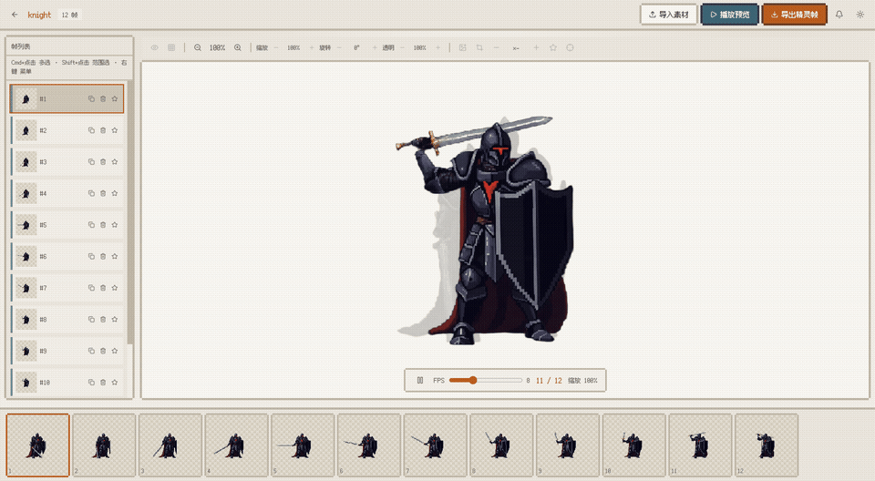

### 骨骼动作工作流

先用部件组装角色，再在当前角色上直接制作动作：在画布上拖骨骼关节或部件控制点网格，按轨道为位移/旋转/缩放/弯曲/自由变形打关键帧，并在项目画板上实时预览效果。

| 动作制作工作区与实时预览 | 在当前角色上编辑动作 |
| --- | --- |
| 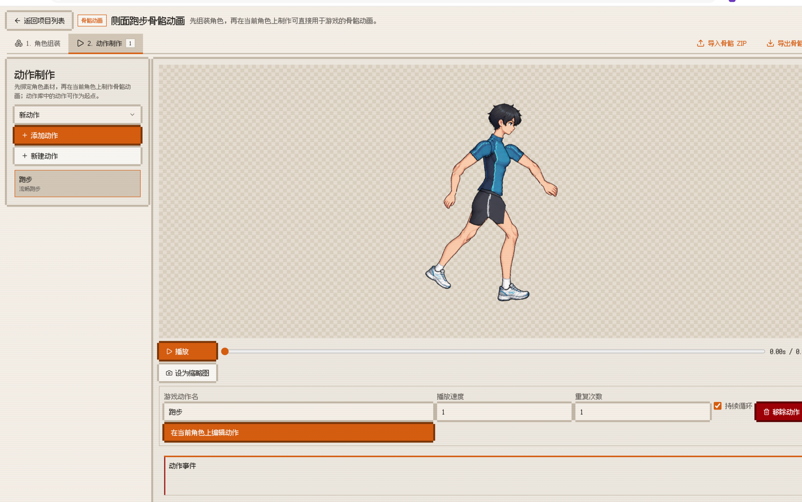 | 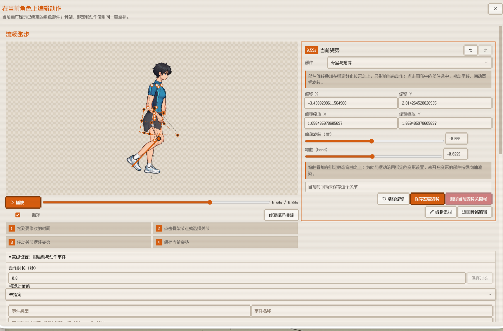 |

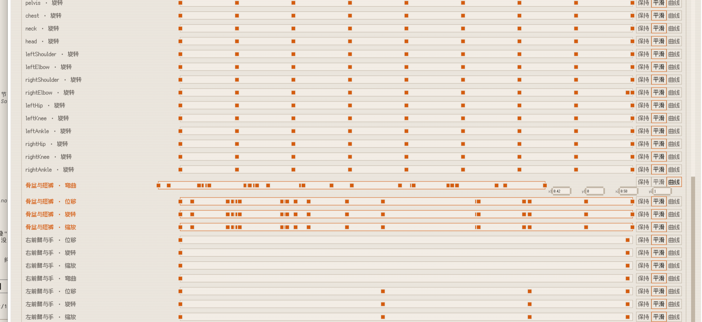

### 人物骨骼分件工作流

基于角色参考图生成并抠出人物分件表，再通过逐格移动、直接拖动分隔线、合并/细分、质量检查和逐格擦除编辑完成网格校正，最后创建骨骼部件素材。

| 人物分件素材 | 可交互分件网格编辑器 |
| --- | --- |
| 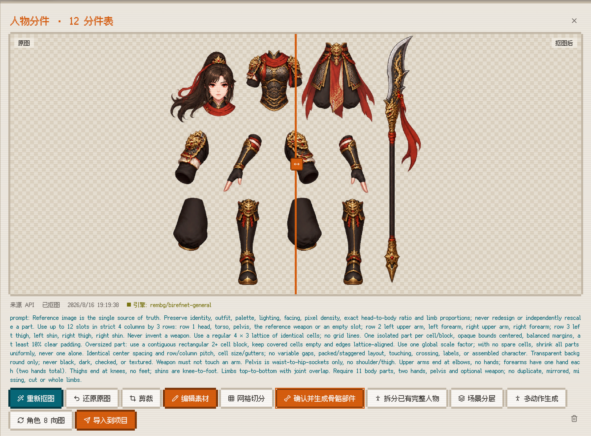 | 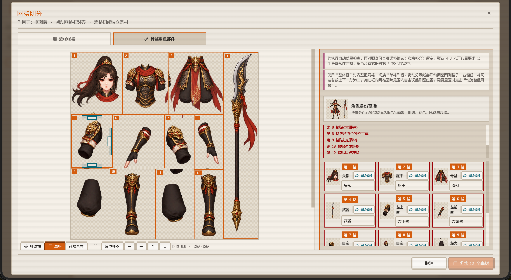 |

| 帧编辑器 | 素材库 |
| --- | --- |
| 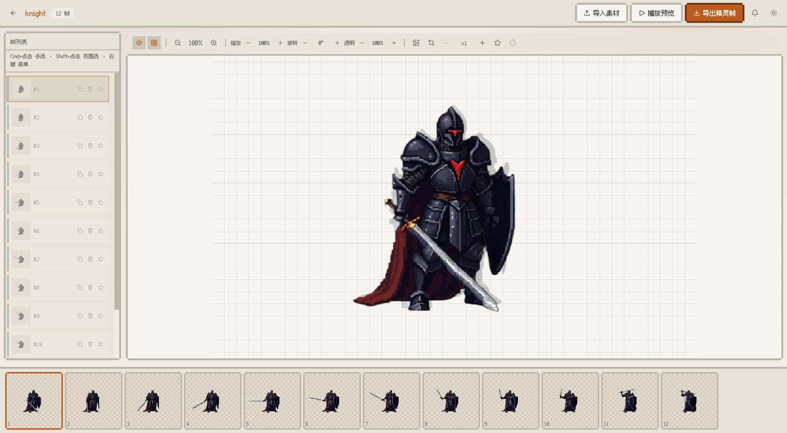 | 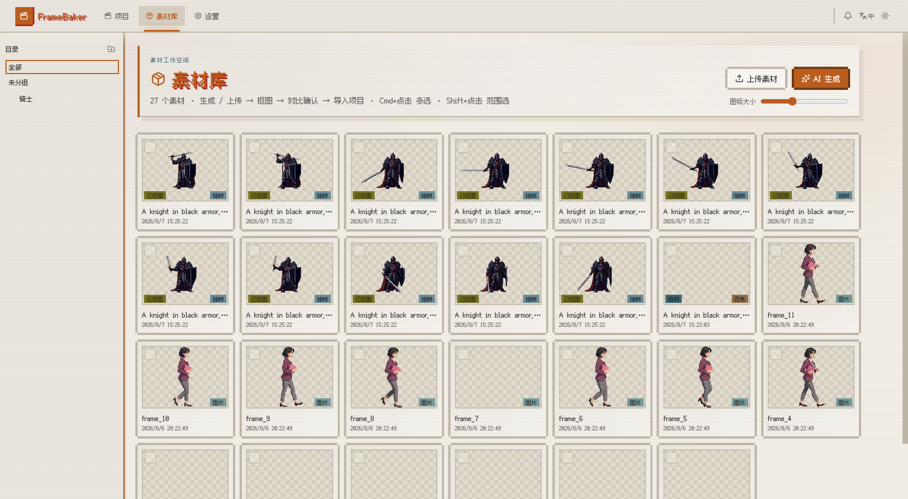 |

| 播放预览 | 深色主题（Magnetic Night） |
| --- | --- |
| 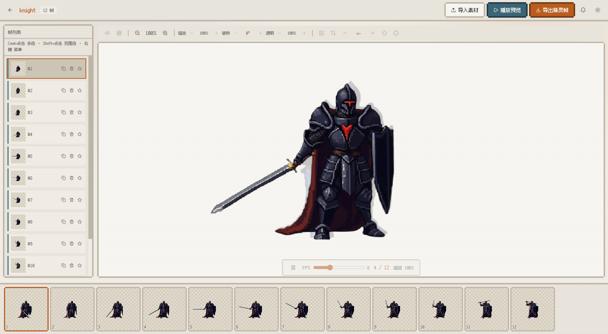 | 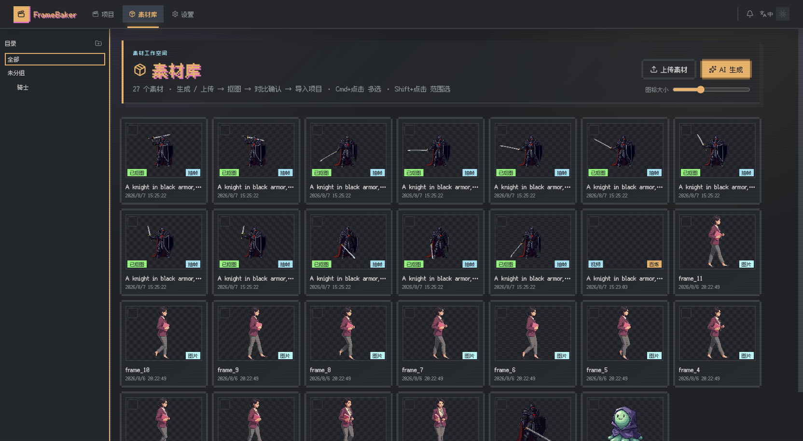 |

| 视频素材（自定义像素风播放器） | 抽帧编辑器（VIDEO CUT LAB） |
| --- | --- |
| 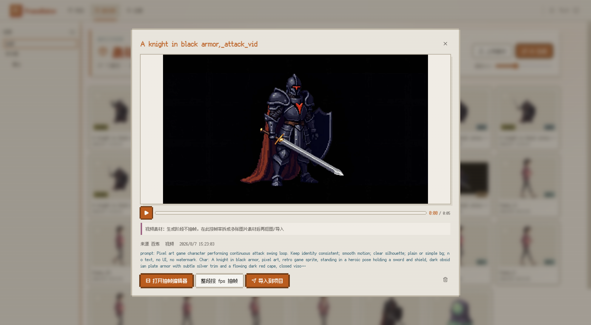 | 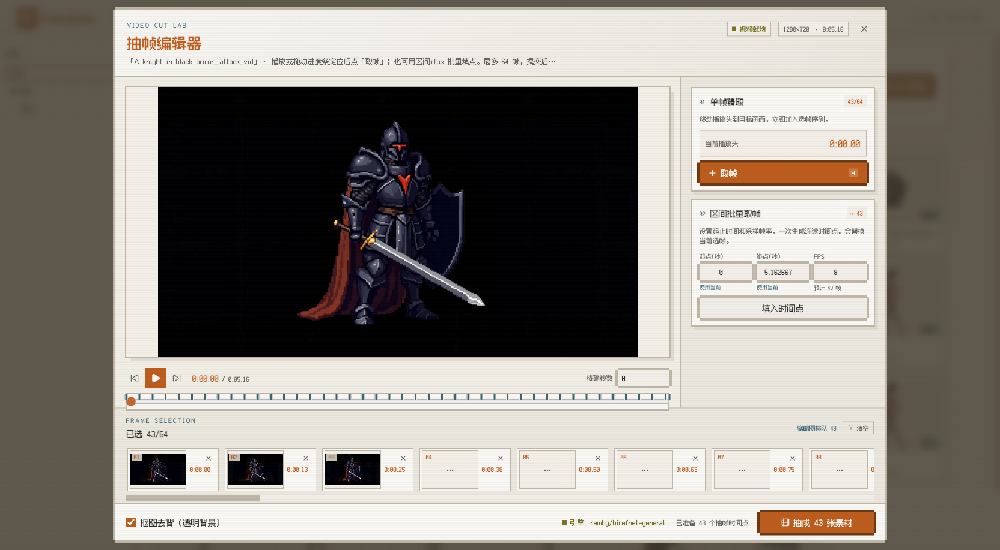 |

## 场景分层演示

场景分层将一张扁平图片重建成多个可独立编辑、隐藏和移动的 RGBA 图层。下面的演示素材在 FrameBaker 素材库中使用 `wan2.7-image` 生成，再由独立配置的 `Qwen-Image-Layered` 以 **4 层 / 50 步 / CFG 4** 实际分解。

| 生成的扁平场景 | 场景分层结果 |
| --- | --- |
|  | 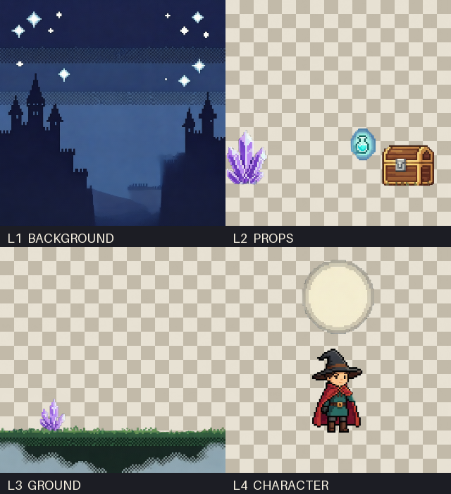 |

- **L1 背景**：夜空与城堡；**L2 道具**：水晶、药水和宝箱；**L3 地面**：草地平台；**L4 主体**：保持完整的炼金师角色与月亮。
- 这是语义图层重建，不是严格的像素标签分割：模型可能把月亮与角色放在同层，也可能让同类元素跨层，但各层可以独立合成和编辑。
- **场景分层不承诺把人物拆成头、躯干和四肢。**角色骨骼拆件属于另一套蒙版/分割工作流，不应拿场景分层结果冒充。
- 完整场景默认不先抠图，以保留背景和景深信息；仅在需要继续细分已独立前景时手动勾选「抠图去背」。

**原场景与四个分层产物在素材库中的实际展示：**

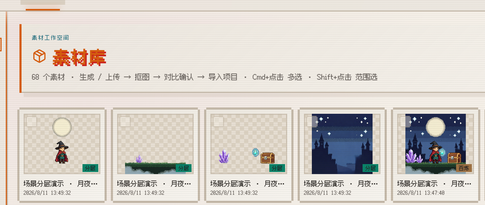

## 特性

- **多来源导入** —— ffmpeg 拆 GIF/MP4 帧（fps 可调）、PNG 多选上传、外部生成 CLI（`FRAMEBAKER_GEN_CLI`）
- **视频素材与抽帧编辑器** —— 生成/上传的视频素材自带自定义像素风播放器（棋盘背景、点击播放暂停、主题进度条）；「VIDEO CUT LAB」抽帧编辑器可拖动进度条精确取帧，也可设置区间+fps 批量打点，一次最多抽取 64 帧图片素材（可在抽帧同时顺带抠图）
- **内置抠图** —— rembg 开箱即用（默认 u2net，可换模型）；也支持自定义 CLI 模板；前后对比滑杆验收去背效果
- **场景分层** —— 独立 Qwen-Image-Layered 配置，把扁平图拆成背景、完整主体、道具和前景等 RGBA 层；支持递归细分，但不冒充人物肢体拆件
- **素材库** —— 一级暂存区：生成/上传 → 抠图 → 对比 → 导入任意项目，支持单个与批量
- **帧编辑器** —— PixiJS v8 画布：洋葱皮、网格、视图缩放、拖拽偏移、图片缩放/旋转/透明度、剪裁替换、帧时长与关键帧
- **时间轴与批量操作** —— 拖拽换序，Cmd/Ctrl+点击与 Shift+点击多选，批量删除/复制/统一时长
- **人形动作骨架** —— 选择采样为 8–16 帧的 CC0 Quaternius Universal Animation Library 现成动作后立即播放，可整段调节动作幅度、手臂摆幅、腿部步幅、身体起伏和前倾，再按需逐帧微调 FK 关节并导出姿态表
- **精灵表导出** —— 纯前端 canvas 拼合，帧变换烘焙到对齐单元格 → `*.spritesheet.png` + `*.json`
- **Cassette Futurism 双主题** —— 深色 Magnetic Night / 浅色 Beige Terminal；默认跟随系统，三态切换（跟随系统/浅色/深色）
- **实时同步** —— WebSocket 广播任务进度与帧/素材变更
- **可调布局** —— 拖拽分隔条调整帧列表宽度与时间轴高度（自动持久化）
- **MCP 服务端** —— 内置 [Model Context Protocol](https://modelcontextprotocol.io) 端点（`POST /mcp`，Streamable HTTP），暴露 69 个工具，让 AI 助手（Claude Desktop、Cursor、Windsurf）程序化管理项目、帧、素材、生成、抠图、任务与设置

## 系统要求

- **Windows 10/11、macOS 或 Linux** —— Windows 已在真机通过服务启动、前端加载、API、SQLite 存储及 ffmpeg 体检验证
- **Bun 1.3+** —— 必需；安装后需重新打开终端，确保 `bun --version` 可用
- **ffmpeg** —— 仅 GIF/MP4 拆帧需要，PNG 导入和其他编辑功能不依赖它
- **uv（推荐）或 Python 3** —— 仅安装内置抠图引擎时需要；uv 可自动下载隔离的 Python，无需预装系统 Python
- 支持 WebGL 的现代浏览器（PixiJS v8 画布）

### Windows 前置环境（PowerShell）

```powershell
# 1. 安装 Bun（也可参考 https://bun.sh/docs/installation）
powershell -c "irm bun.sh/install.ps1 | iex"

# 2. 安装 ffmpeg（需要 GIF/MP4 拆帧时）
winget install ffmpeg

# 3. 安装 uv（需要抠图时；也可改装 python.org 的 Python 并加入 PATH）
powershell -ExecutionPolicy ByPass -c "irm https://astral.sh/uv/install.ps1 | iex"

# 安装后重新打开 PowerShell 并验证：
bun --version
ffmpeg -version
uv --version
```

> `setup_matting.ps1` 优先使用 uv 创建 Python 3.12 隔离环境；没有 uv 时才回退 PATH 中的 Python。Microsoft Store 的 `python.exe` 应用执行别名不等同于已安装 Python。

## 快速开始

```bash
bun install
bun dev          # 开发模式（--hot）→ http://localhost:3000
# 或
bun start        # 生产
```

- 拆帧依赖 ffmpeg：`brew install ffmpeg`（macOS）/ `winget install ffmpeg`（Windows）
- **抠图引擎**（可选；每个新环境只需安装一次）：
  ```bash
  ./scripts/setup_matting.sh            # macOS / Linux（CPU，默认）
  ./scripts/setup_matting.sh --gpu      # macOS / Linux（NVIDIA GPU，onnxruntime-gpu）
  # Windows（PowerShell）：
  powershell -ExecutionPolicy Bypass -File scripts\setup_matting.ps1           # CPU
  powershell -ExecutionPolicy Bypass -File scripts\setup_matting.ps1 -Gpu      # GPU
  ```
  创建 `.venv-matting/` 并安装 `rembg[cli,cpu]`（或 `rembg[cli,gpu]`）；Windows 上优先使用 uv 管理 Python 3.12。u2net 模型在首次抠图时自动下载到 `storage/models`。不安装则抠图退化为 passthrough（复制原图并给出警告）。

  **GPU 模式**需要 NVIDIA 显卡和匹配版本的 CUDA Toolkit。`onnxruntime-gpu` 版本必须与 CUDA 版本对应（如 onnxruntime-gpu 1.16 ↔ CUDA 11.8，1.17+ ↔ CUDA 12.x）。如果遇到 DLL 加载错误，请检查 CUDA 是否安装且版本匹配。CPU 和 GPU 之间切换：删除 `.venv-matting/` 后用对应参数重新运行脚本。
- 类型检查：`bun run typecheck`
- 单元测试：`bun run test`
- 核心单测覆盖率报告：`bun run test:coverage`（当前覆盖共享规则、帧几何与 ZIP 导出）

### Windows 注意事项与常见问题

项目在 Windows 上可以正常运行，但有几个平台相关的坑需要注意：

1. **`bun dev` 使用 `--watch` 而非 `--hot`** —— Bun 1.3 在 Windows 上的浏览器 HMR 会打乱 PixiJS 8 循环依赖的初始化顺序，导致画布空白。因此 dev 脚本改用 `--watch`（服务端文件变化自动重启，但前端不 HMR）。**前端改动后需要手动刷新浏览器**。macOS/Linux 仍保留完整 HMR。

2. **PixiJS 从 CDN 加载，不走 npm 包** —— `apps/web/index.html` 通过 `<script>` 标签引入 `cdn.jsdelivr.net/npm/pixi.js@8.19.0/dist/pixi.min.js`，绕过 Bun 打包器对 PixiJS 循环 import 的错误处理。首次加载需要能访问 `cdn.jsdelivr.net`，之后使用浏览器缓存。如需离线使用，可将 `pixi.min.js` 下载到 `apps/web/public/` 并修改 `<script>` 路径。

3. **服务端 dev 模式在 Windows 上被禁用** —— `apps/server/src/index.ts` 在 `win32` 下设 `development: false`，阻止 Bun 的 HTML dev server 注入会触发同样 PixiJS 问题的 HMR 脚本。不影响生产模式（`bun start`）。

4. **每次拉取或依赖变更后必须 `bun install`** —— Bun 的隔离式 workspace 布局意味着本地 `@framebaker/shared` 包只有在 `bun install` 后才能解析。跳过这一步，Bun 可能从全局缓存加载第三方包，却无法解析 workspace，导致 import 报错。

5. **PowerShell 环境变量语法** —— 用 `$env:PORT=8080; bun dev`（分号分隔，不是 `&&`）。旧版 PowerShell 不支持 `&&` 操作符。macOS/Linux 用 Bash 语法 `PORT=8080 bun dev`。

6. **PowerShell 脚本执行策略** —— `setup_matting.ps1` 需要 `-ExecutionPolicy Bypass`（如 `powershell -ExecutionPolicy Bypass -File scripts\setup_matting.ps1`）。脚本以纯 ASCII 编写，兼容 Windows PowerShell 5.1（无需 UTF-8 BOM）。

7. **Microsoft Store 的 `python.exe` 不是真正的 Python** —— Windows 自带的「应用执行别名」`python.exe` 会打开 Microsoft Store 而非运行 Python。请从 [python.org](https://www.python.org/downloads/) 安装（勾选「Add to PATH」），或安装 [uv](https://docs.astral.sh/uv/)（可自动下载隔离 Python，无需系统安装）。`setup_matting.ps1` 优先使用 uv，仅在没有 uv 时才回退 PATH 中的 Python。

8. **Windows 脚本路径用反斜杠** —— 在 PowerShell 或 cmd 中运行脚本时用 `scripts\setup_matting.ps1`，不要用正斜杠 `scripts/setup_matting.ps1`。

## 抠图引擎解析顺序

服务按需实时探测（可用 `GET /api/config` 查看）：

1. `FRAMEBAKER_MATTING_CLI` —— 自定义命令模板（占位符 `{input}` `{output}`，可选 `{model}`）
2. `<repo>/.venv-matting` 内置 rembg（POSIX 为 `bin/rembg`，Windows 为 `Scripts/rembg.exe`）—— 由 `scripts/setup_matting.sh` / `setup_matting.ps1` 安装（engine = `rembg-bundled`）
3. PATH 中的 `rembg`（engine = `rembg-path`）
4. 都没有 —— passthrough 复制原图并提示安装（engine = `none`）

rembg 调用形式为 `rembg i -m <MODEL> input output`；模型默认 `u2net`，统一缓存在 `storage/models`（自动注入 `U2NET_HOME`）。

## 环境变量

| 变量 | 说明 |
| --- | --- |
| `PORT` | 服务端口，默认 `3000` |
| `FRAMEBAKER_GEN_CLI` | 生成 CLI 模板，占位符 `{prompt}` `{output}` `{index}` `{reference}`。例：`FRAMEBAKER_GEN_CLI='mygen --prompt "{prompt}" --ref {reference} -o {output}' bun dev`。`{reference}` 为界面里选择的引用图（素材或项目帧，服务端按 id 解析路径防注入）——选了引用图但模板缺 `{reference}`，或模板有 `{reference}` 但没选，创建任务时直接 400 |
| `FRAMEBAKER_MATTING_CLI` | 自定义抠图 CLI 模板，占位符 `{input}` `{output}`（可选 `{model}`），优先于内置 rembg |
| `FRAMEBAKER_MATTING_MODEL` | rembg 模型名，默认 `u2net`（如 `birefnet-general-lite`、`isnet-general-use`） |

## 项目结构

Bun workspaces monorepo：

- `apps/server`（@framebaker/server）—— Elysia API + 内存任务队列 + bun:sqlite；经 Bun HTML import 托管前端
- `apps/web`（@framebaker/web）—— React 19 + pixi.js v8 + motion + lucide-react
- `packages/shared`（@framebaker/shared）—— 前后端共享类型与常量
- `scripts/` —— 安装脚本与统一 SemVer 版本管理脚本
- `docs/` —— 文档，包括独立的[变更日志](docs/CHANGELOG.zh-CN.md)
- `storage/` —— 运行时数据（SQLite、帧、素材、rembg 模型；已 gitignore）

## 文档

- [docs/guide.zh-CN.md](docs/guide.zh-CN.md) —— 使用指南（设置页、provider 配置、剪裁工具、素材加工、编辑器）
- [docs/architecture.zh-CN.md](docs/architecture.zh-CN.md) —— 架构图、模块说明、数据流、存储布局
- [docs/api.zh-CN.md](docs/api.zh-CN.md) —— API 一览（含请求/响应示例）、WS 事件、MCP 端点
- [docs/roadmap.zh-CN.md](docs/roadmap.zh-CN.md) —— 已完成清单与后续规划
- [docs/CHANGELOG.zh-CN.md](docs/CHANGELOG.zh-CN.md) —— 按版本记录功能与 Bug 修复
- [docs/VERSIONING.zh-CN.md](docs/VERSIONING.zh-CN.md) —— main 发布使用的 `MAJOR.WEEK.BUG` 规则

## MCP（AI 助手集成）

FrameBaker 内置 MCP 服务端，让 AI 助手通过 [Model Context Protocol](https://modelcontextprotocol.io) 控制全部功能。

**端点：** `POST /mcp`（Streamable HTTP，JSON-RPC 2.0，协议版本 `2024-11-05`）

启动服务（`bun dev` 或 `bun start`），然后在 AI 客户端中配置：

**Claude Desktop**（macOS `~/Library/Application Support/Claude/claude_desktop_config.json`，Windows `%APPDATA%\Claude\claude_desktop_config.json`）：

```json
{
  "mcpServers": {
    "framebaker": {
      "url": "http://localhost:3000/mcp"
    }
  }
}
```

**Claude Code**（CLI）：`claude mcp add framebaker --transport http http://localhost:3000/mcp`

**Cursor**（`.cursor/mcp.json`）：`{ "mcpServers": { "framebaker": { "url": "http://localhost:3000/mcp" } } }`

**Windsurf**（`~/.codeium/windsurf/mcp_config.json`）：`{ "mcpServers": { "framebaker": { "serverUrl": "http://localhost:3000/mcp" } } }`

服务端暴露 **69 个工具**，覆盖项目、帧、素材、生成、抠图、文件夹、任务与系统配置。完整工具列表与调用示例见 [docs/api.zh-CN.md](docs/api.zh-CN.md)。

## 许可

[MIT](LICENSE) © 2026 taotao7

界面字体为 **Fusion Pixel 12px**（`apps/web/public/fonts/`），采用 SIL Open Font License 1.1 —— 详见 `apps/web/public/fonts/OFL.txt`。

### 致谢与第三方项目

- [Universal Animation Library](https://quaternius.com/packs/universalanimationlibrary.html)（Quaternius，CC0 1.0 Universal）—— FrameBaker 从 Standard GLB 抽取、正交投影并重定向 `Idle_Loop`、`Walk_Loop`、`Sprint_Loop`、`Sword_Attack`、`Hit_Chest`、`Death01`、`Jump_Start` 和 `Jump_Land`，转换为内置二维局部旋转动作；跳跃预设把起跳和落地片段组合为紧凑的游戏动作轨迹，本仓库不打包原始 GLB。
- [huchenlei/sd-webui-openpose-editor](https://github.com/huchenlei/sd-webui-openpose-editor)（Chenlei Hu，MIT License）—— 动作工作台设计时评估了其姿态操作流程与 COCO-18 约定；最终简单工作流没有嵌入该专业编辑器，本仓库也未打包其源码。
- [ZhUyU1997/open-pose-editor](https://github.com/ZhUyU1997/open-pose-editor)（Yu Zhu，MIT License）—— 逐关节微调交互参考了其变换 gizmo 与姿态预览流程；本仓库未打包其源码。

## 已知限制

任务队列在内存中（重启丢未完成任务）；GIF 拆帧忽略帧延迟；单图导入按字节落盘（建议 PNG）；精灵表不做 trim；无鉴权仅限本地。改进计划见 [roadmap](docs/roadmap.zh-CN.md)。

<!-- latest-changelog:start -->
## 最近更新

### [0.5.0](docs/CHANGELOG.zh-CN.md#050---2026-10-03) · 2026-10-03

#### 新增

- 新增无限画布节点工作流（`/graphs` 页）：React Flow 画布 + 节点连线搭建资产管线（视频素材 → 抽帧 → 批量抠图 → 导出精灵表），节点拖动位置持久化，执行状态经 WS 实时回填节点（运行/完成/缓存命中/错误描边）。
- 工作流执行引擎：拓扑排序 + 内容寻址缓存（`content_hash` = 节点类型 + 规范化参数 + 上游端口哈希），改末端参数重跑时上游节点全部缓存命中；产物与 payload 全部落库，重启后已完成节点直接命中；支持执行中取消（AbortSignal 杀 ffmpeg 子进程）。
- 新增 graphs / graph_nodes / graph_edges / graph_outputs 四表与图 CRUD API（端口类型校验、单输入端口唯一、级联删除），以及 7 个 MCP 工作流工具（后续补齐至 17 个，见下）。
- 迁移 sprite 工坊抠图管线：`matte_cli.py` CLI 薄壳 + `matte.pipeline` 组合节点（与 sprite `apply_matte_pipeline` 逐像素一致）+ 6 个单步原子抠图节点 + `image.decontaminate` 边缘净化；配置走 `spriteMatting` 设置项，与全局 rembg 抠图共存。
- 迁移 sprite 像素量化：`quantize.pixel` 节点（imageops worker 执行，主线程降级），与原版逐字节一致。
- 迁移 sprite UI 智能切片：`slice.ui.analyze` 检测 + `slice.ui.crop` 裁剪（连通域复用 imageops 单份实现），检测候选框与原版逐值一致。
- 客户端节点执行通道：executor 经 WS 派发任务给打开画布的浏览器，worker 算完回传产物或分析结果；`slice.ui.analyze` 支持 `interactive` 人在环模式 —— 分析后暂停，画布上调整候选框再继续下游，人工调整随缓存持久（重启不丢）。
- 画布交互补全：双击/右键节点编辑参数（paramsSchema 驱动表单 + 素材下拉）；连线按端口类型着色（悬停加粗、点击删除、拖拽预览虚线）；右键节点上下文菜单。修复一个从画布上线起就存在的隐患——节点未渲染 React Flow Handle 导致连线静默消失。
- sprite 视频抽帧流水线完整对齐：新增输出·帧图片（export.frames）、输出·透明视频（export.video，qtrle/argb 与 sprite save_alpha_mov 一致）、输出·完整包（export.package：png/webp 图集 + frames.zip + export.json + Phaser/Starling/Cocos/Godot/Urho3D 六种引擎 manifest，生成器逐字移植）；帧处理节点 帧·裁剪、帧·画布归一（贴底/居中方形）、帧·Alpha 处理（绿转黑/半透明转黑/转不透明，复用 sprite 原函数）、智能选帧（差异签名 + 分桶去重，对齐 suggest_job_frames）；全部节点产物在节点卡片内联缩略图预览（图片/视频），点击 lightbox 放大。
- UI 切片工作流（sprite ui-layer-lab 完整能力接入）：新节点「UI 图层拆分」（ui.layer.analyze，matte_cli.py --op ui-analyze）——OpenCV Canny 候选框检测（alpha 覆盖 <98% 时按纯色背景分离）+ 每候选 GrabCut 前景蒙版切透明图层，适配实底 UI 截图（与 slice.ui.analyze 的纯 alpha 连通域互补，后者适合已去底图）；参数：最大图层数/最小边/图层模式（去底/原图裁块/两者）。新增「UI 切片」工作流模板（图片素材 → UI 图层拆分 → 入库·素材库 + 输出·帧图片）。实测：合成 UI 大图（双按钮/圆/方块/文本）5 候选全中、bbox 精准、5 图层入库素材库。
- 九项交互改进：1) 工具栏重组——导入/新建/导出/任务全部并列右侧，任务面板从悬浮 FAB 改为工具栏入口（ListTodo 图标，运行中显示红点）；2) 画布缩放控件修复——内置 Controls 与 useReactFlow/instance 三条 store 通道在本页受控重渲染下全部失效（d3 transform 纹丝不动，实测确认），自绘按钮改走 d3 原生 wheel/dblclick 通道（实测放大 1→1.18、缩小、适配 0.5 全生效）；3) 打开文件夹定位修复——explorer 需反斜杠原生路径（正斜杠会回落到"文档"），对齐 sprite os.startfile 语义；产物面板新增「保存到…」（POST /api/graph/save-artifacts 复制产物目录到自定义位置，showDirectoryPicker 优先、路径输入兜底）；4) lightbox 关闭按钮提到 z-62 且悬停变红；5) 抠图·组合管线参数按模式显隐——未勾选模式的专属参数隐藏（chroma/spriteflow/birefnet/corridorkey/luma+additive 各自映射，净化/特效保护为公共参数，开关全空的旧图全显）；6) 侧栏可收起（Ctrl+B 或左下角图标，localStorage 持久化）可拖拽调宽（160-420px，修了闭包旧值导致宽度不落盘的 bug）；7) 新节点：入库·素材库（frames.to-material，图产物回素材库打通图→编辑器链路，实测 2 帧入 2 素材）、AI 生成图片（generate.image，复用 FrameBaker 生成 provider）。
- 工作流导入/导出：顶部工具栏「导出」把当前图存为 JSON（图名+节点类型/参数/位置+连线，索引式边）；左侧图列表「导入」选 JSON 还原为新图（未知节点类型整体拒绝、端口不兼容连线容错丢弃、素材 id 需重选）。round-trip 验证 8 节点 7 连线完全一致。视频抽帧流水线模板默认抠图改为 SF 色键（容差 15，勾选 useSpriteflow）。
- 导出产物文件操作：export.* 产物节点卡片新增「产物」面板 —— 展开列出产物目录清单（文件名+大小+frames/ 子目录），每个文件可点击下载（media 路由加 download 参数返回 Content-Disposition attachment）；「打开文件夹」按钮经 POST /api/graph/open-folder 直接在资源管理器打开产物目录（限定 storage/graph/outputs 下）。outputDir 贯穿 executor done 广播与图文档（后开页面也有面板）。
- 画布归一帧间抖动修复：frame.canvas 从逐帧调用改为整批一次 CLI 调用（matte_cli.py 新增 --op resize-batch）——stable_box 取全帧 alpha bbox 并集，全帧共用同一裁剪区/画布宽/贴位置。此前逐帧独立算 bbox，导致自适应模式画布宽度忽宽忽窄、方形居中内容左右跳（sprite 的 stable_resize_frames 本就是批处理语义）。与 sprite 批处理直调逐像素一致（3 帧内容大小位置全不同 → 输出画布统一、IDENTICAL）。
- 预览背景切换（对齐 sprite PreviewPanel）：节点缩略图默认改深色棋盘格——白色半透明纹理（发丝/冰纹）在浅色画布上会炸成"蛛网"观感，深底才是真实效果；Lightbox 顶部新增背景切换条（棋盘格/深色/浅色/自定义+取色器），切换实时同步到全画布缩略图，选择持久化 localStorage。
- 修复抠图黑边/水墨感（根因：非预乘 alpha 缩放）：frame.canvas 原用 ffmpeg scale，透明像素的黑色 RGB 会被线性插值混进半透明边缘 → 边缘发暗。改走 matte_cli.py 新增的 --op resize（复用 sprite stable_resize_frames：alpha bbox trim → RGB×alpha 预乘 → LANCZOS → 除回 → 画布模式贴合），与 sprite 预览逐像素一致（同源帧 maxdiff=0；端到端视觉 diff 从 55.6% 降到 0.1%）。新增「裁掉透明边」参数（默认开，对齐 sprite）；画布模式默认改 auto（自适应宽度）；模板抠图与画布参数全部对齐 sprite 默认（80/32/0.85/1，512/20/auto）。
- 立即预览沿链计算：「立即预览」不再只显示原始帧——取该秒帧后自动沿下游服务端节点链执行（含抠图管线，用图中真实参数），预览即处理效果；preview.frame 自身无下游时自动借用同源视频素材的主链（extract→matte→canvas…）；跳过终端输出节点、客户端节点与选帧类节点（单帧语义下无意义），多输入节点无法从单帧构造的跳过；节点卡片显示「过 N 步」徽标（hover 看链路），某步失败预览停留上一步。抠图参数改动即时反映（阈值 80/200 预览差异 4076 像素验证）。
- 四项反馈修复：1) 右键菜单误触——仅真右键（button===2）打开菜单，点击节点控件/非右键 contextmenu 不再误弹，点节点任意处即关残留菜单；2) 任务悬浮按钮被顶部导航遮挡（top 14px→70px，导航 60px）；3) 抠图特效黑边/水墨感——根因是参数默认值未对齐 sprite 前端（threshold 42→80、softness 12→32、despill 0.5→0.85、halo 0→1），视觉对比确认新默认边缘平滑无暗边，registry 与 matte_cli argparse 双侧同步；4) 单帧预览即时化——preview.frame 未执行也能看帧：时间轴常显（时长探测后回填），新增「立即预览」按钮走轻量 API（POST /api/graphs/:id/preview-frame，不执行全图不落缓存，staging/preview_frame 加入受限媒体白名单）。
- 任务悬浮面板（ComfyUI 式）：右上角固定「任务」按钮，运行中显示数量角标；面板内实时滚动当前运行的图名与节点进度（WS 直连），下方执行历史（graph_runs 服务端落库，重启不丢）显示每次运行的图名/时间/节点统计（done+cached/total、失败红色、运行中脉冲），点击历史条目跳转对应工作流。- 参数变更即时失效提示与重跑状态重置：节点参数一改即标黄描边（含全部下游——提示哪些节点将重算），点执行先清空全部节点的上次状态/预览再跑（缓存命中节点即刻回填缩略图）；实测改 targetCount 12→15 后 smart-select 重算为 15 帧且上游缓存命中。
- 抠图模式多选（管线语义）：matte.pipeline 的单选下拉改为 6 个模式开关（绿幕/SpriteFlow/BiRefNet/CorridorKey/Luma/发光特效），可任意组合（如色键+发光）——固定顺序执行 + alpha 并集合并（ImageChops.lighter），additive 的全局行为（跳过去溢色与边缘净化）在组合中自动保留；与 sprite apply_matte_pipeline 多模式路径像素等价（双开关输出与 CLI 直调 chroma,additive maxdiff=0）；旧图兼容回落 legacy pipeline 字符串。
- 单帧预览工作流（对齐 sprite preview_frame）：新增 preview.frame 节点 —— 指定秒取单帧，节点卡片内时间轴拖动（0.1s 步进，带时长显示）+「取帧」按钮，下游接抠图节点即得该帧抠图效果；内容寻址缓存让取帧只重跑该节点与下游。抽帧节点补齐区间（startTime/endTime）与隔帧（keepEvery）参数；抠图·组合管线补齐 sprite 全参数（键色来源/手动键色/AI 设备/走廊幕色/SF 系列/净化半径强度/特效保护——高亮半透明像素恢复不透明）；参数下拉化：抠图模式 6 选（含发光特效）、画布模式、图集格式、量化算法/抖动、推理设备等全部 enum 下拉，引擎 manifest 改为 6 个独立开关。
- 节点内联参数编辑（ComfyUI 风格）：全部参数以「标签+输入控件」平铺在节点卡片上直接改（数字/文本/布尔/下拉，防抖 400ms 落库，nodrag 不干扰画布拖拽），参数摘要与双击弹窗编辑退役为兜底；素材字段下拉内置「上传素材…」入口 —— 视频/GIF/PSD 以 graphRaw 模式原样直存为单素材（不拆帧），上传即选中即绑定。
- 工作流模板：「从模板新建…」下拉一键创建 sprite 视频抽帧流水线默认模板（视频素材→抽帧 8fps→组合抠图→画布归一→智能选帧→完整包/透明视频/帧图片三分支，8 节点 7 连线参数全预设）；GET /api/graph/templates 列模板、POST /api/graph/templates/:id/graphs 建图。
- 完整对齐补遗：export.package 支持 rectpack 紧凑装箱布局（MaxRectsBssf 自实现，不等大帧自动 packed，layout/frame_positions 记录真实坐标）；图集合成全部改走 PIL paste（ffmpeg overlay 有色度抖动，PIL 逐像素零损——与 sprite 一致）；lightbox 支持多帧序列播放（播放/暂停、fps 滑杆 1-30、帧缩略条点选），产物预览在图文档里持久化（后开页面/重启也显示）；新增 PSD 分层（material.psd）、背景修补（image.bg-inpaint，LaMa→OpenCV 回退）、姿态检测（pose.detect）、人体解析（human.parse）、场景分层（image.layers，复用 FrameBaker image_layers）五个节点——AI 依赖未安装时给出明确安装指引。
- 任务队列持久化：任务负载随 jobs 表落库（payload 列），服务重启后 queued 任务自动恢复入队继续执行（从未启动、无副作用）；running 任务因无法断点续传统一标记中断并提示重新发起；拆帧源文件已不存在的恢复任务给出明确指引；升级前遗留的无负载任务按「负载缺失」标记。任务负载在运行中丢失内存记录时也可从库中反序列化重建。
- 逐帧动画导出新增两种游戏引擎格式：TexturePacker JSON Hash 图集（Phaser 3 / PixiJS / Cocos 直接加载，逐帧声明不透明矩形，引擎按 spriteSourceSize/sourceSize 还原对齐、帧原点稳定不抖）；Godot 4 SpriteFrames 资源（PNG 序列 + .tres，AnimatedSprite2D 直接选用；speed/duration 按官方公式零失真换算，附导入说明）。原有 PNG 序列、单张精灵图与 frames.json 元数据保持不变。
- 桌面版自动更新：集成 electron-updater（更新源 GitHub Releases），启动后台静默检查新版本；设置页新增「软件更新」节（仅 Electron 壳内显示），展示当前版本并支持手动检查、下载（实时进度）与安装重启（自动清理后端进程后退出安装）。安装包产物名统一为 `FrameBaker-Setup-x.y.z.exe`，修复 latest.yml 引用名与实际产物名不一致导致的下载 404 隐患；打包脚本在检测到 GH_TOKEN 时自动发布到 GitHub Releases，本地打包行为不变。
- MCP 新增本地文件导入口 `import_local_material`：把服务器本地绝对路径（单文件或目录）登记进素材库，等价于 UI 的「导入」按钮。一个文件 = 一个素材、不拆帧（视频/GIF 想拆帧再调 `extract_material_frames`）；目录按文件名自然序批量导入其中全部受支持文件；支持 png/jpg/jpeg/webp/bmp/tga/gif/psd 与 mp4/mov/webm/avi，kind 由扩展名推断。素材来源新增独立枚举 `file`（徽标「本地文件」），与 UI 上传、AI 生成可区分。用于把外部产物（ffmpeg 抽帧、外部 AI 输出）直接喂进库，供 `material.video` / `material.image` 图节点与编辑器消费。拷贝与写库视为一个单元（写库失败清理素材目录，不留孤儿）；拒绝符号链接（避免绕过扩展名白名单）；目录批量逐文件容错，失败项经 `failed[]` 返回；子目录与不支持的文件均计入 `skipped`（不静默丢弃）。
- MCP 工作流工具补齐至 17 个（对齐图 REST 全能力）：新增 `update_graph_node`（改节点参数/位置——此前只能用 `add_graph_node` 一次性带参数，建完就改不了，是程序化搭图的实际阻碍）、`delete_graph_node`（级联删边）、`delete_graph_edge`、`update_graph`（重命名）、`import_graph`（JSON 导入）、`list_graph_templates` 与 `create_graph_from_template`（模板实例化）；`create_graph` / `add_graph_node` / `connect_graph_nodes` / `delete_graph` 补齐 `graphs_changed` 广播与 `updated_at` 刷新，与 REST 处理器行为一致。

#### 移除

- 移除了参考图拆分中的目标骨架选择器：它只影响生成提示词与网格行列，下游切分、命名与绑定均不消费，且 `targetSkeletonId` 从未被服务端接收；拆分网格恢复为手动行列 + 人形默认值。

### [0.4.0](docs/CHANGELOG.zh-CN.md#040---2026-08-20) · 2026-08-20

#### 新增

- 角色绑定编辑器新增项目级关节角度修正：逐骨骼基础旋转随角色持久化，并统一应用于静止姿势、所有动作及 `.fbanim` 导出，不会修改共享骨架资产。
- 新增确定性的柔性附件变形：披风等软性部件支持画布弯曲拖拽，以及静态弯曲、播放摆幅、方向、频率和相位控制。
- 新增完整人物骨骼分件表工作流：支持逐格取图、直接拖动分隔线、矩形合并、右键横向/纵向细分、质量门禁预览，以及入库前逐部件擦除编辑。
- 骨骼切分弹窗新增连通域自动检测：按不透明块逐个识别为部件单元（阅读顺序排列），避免均匀网格切穿部件；检测出的每格仍可微调、切分、合并与命名。
- 新增人形骨架语义诊断与自动组装的共享层能力及测试（尚未接入界面）。
- 骨骼绑定的素材图片选择器新增文件夹筛选，支持多级目录路径以及“全部”和“未分组”视图。
- 素材库右键菜单、REST API 与 MCP 工具新增素材重命名，并立即同步当前打开的素材视图。
- 补齐图片素材右键菜单，可直接进入剪裁、逐帧/骨骼切分、人物拆分、多动作/八方向生成、还原抠图、导入、场景分层、自动裁边、导出与删除。
- 动作事件支持输入、校验并查看可选 JSON payload，数据随 MotionClip 持久化。
- 新增 MotionClip schema v2：逐片段 cubic-bezier 时间曲线、显式无损 v1 迁移、四元数缓动 slerp、曲线编辑及 `.fbanim`/光栅烘焙兼容。
- 部件新增自由变形：绑定编辑器中可为部件启用可拖拽的控制点网格（2×2/3×3/4×4）做静态变形，动作时间轴上的 `att:` warp 轨道以同样的网格增量打关键帧；变形位图按确定性光栅化（最近邻取样）生成，合成顺序在弯曲滤镜之前，并完整支持 `.fbanim` 导出再导入。

#### 调整

- 内置人形骨架及关节名称现会在骨架选择、动作编辑、画布提示、时间线和角色绑定中随界面语言切换，自定义名称仍保持用户原文。
- 优化人物分件提示词：用户指定的网格仅代表容量，允许多余透明格和超大部件占用连续矩形多格，并禁止为填满网格虚构部件或武器。
- 拖动分隔线时仅调整当前格及该边界正对的关联格，左右其他格不再随整条分隔线一起变化。
- 骨骼项目统一只输出 `.fbanim` 运行时包，移除逐帧项目兼容烘焙线路、RenderProfile 与 RasterSequence API。

#### 修复

- 选中附件的变换框现会直接接管画布拖动，重叠部件不再把弯曲或变换操作错误转移到其他图层。
- 橡皮擦拖出编辑画布时现会一直擦到图片实际边界，同时质量检查不再把几乎透明的抗锯齿残留误报为分件贴边。
- 修复骨骼项目编辑器不感知动作资产保存的问题：动作页签的实时预览画板与角色页签的骨骼/绑定视图现订阅 `animation_assets_changed`，动作编辑弹窗（或其他页面）一旦保存即重新拉取当前动作、骨架与资产列表。

[查看完整变更日志 →](docs/CHANGELOG.zh-CN.md)
<!-- latest-changelog:end -->
